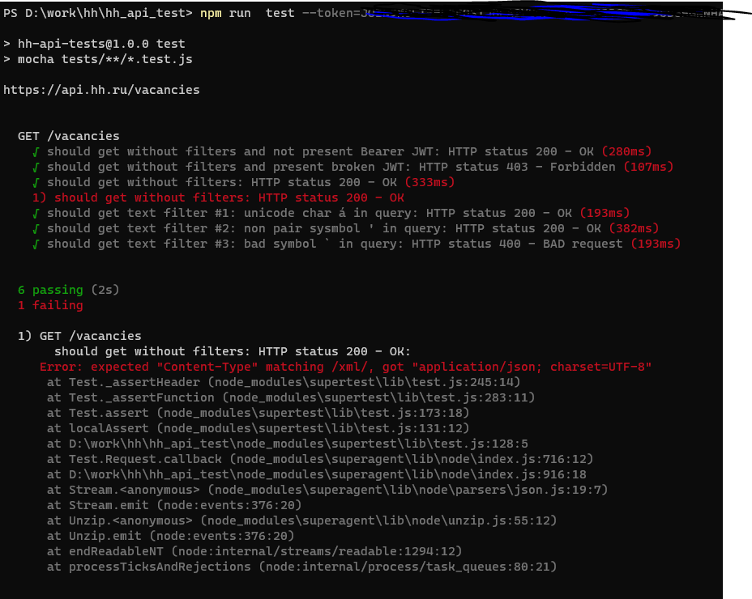

# Домашняя работа HH - тестирование

Использован javascript в качестве ЯП, фрамеворк mocha.

constants - вынес токен и URL
vacancies.test - тесты для */vacancies*

```
запуск  npm run  test --token=секрет
```
*^секрет - без кавычек*

Шесть из семи тестов проходят успешно, один проходит с ошибкой
1. тест - без токена авторизации - успешно
2. тест - невалидный токен - 403 недостаточно прав
3. тест - невалидный токен, без параметров
4. тест - передаем контент тип XML, тест проходит с ошибкой, так как АПИ всегда отдает только JSON
5. тест - в поиске содержится символ  á
6. тест - в поиске лишняя одинарная кавычка
7. тест - в поиске символ ` 400 ошибка


